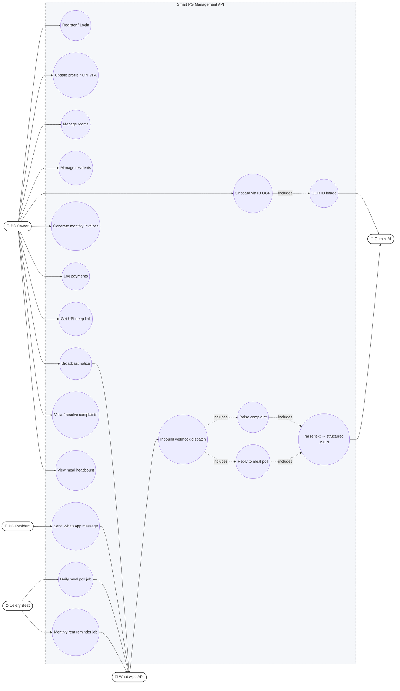

# Smart PG Management API — Diagrams

Both diagrams use [Mermaid](https://mermaid.js.org/) and render natively on
GitHub. They are derived from `requirements.md` and the module layout in
`README.md`.

## 1. Requirements Diagram

SysML-style decomposition of the SRS into functional, AI, and
non-functional requirements with their inter-dependencies.

```mermaid
requirementDiagram

requirement SRS {
  id: 1
  text: "Smart PG Management API - multi-tenant SaaS backend"
  risk: medium
  verifymethod: test
}

%% --- Functional ---
functionalRequirement Auth {
  id: 4.1
  text: "PG owner registration and JWT login"
  risk: high
  verifymethod: test
}

functionalRequirement PropertyMgmt {
  id: 4.2.1
  text: "CRUD rooms with dynamic available_capacity"
  risk: low
  verifymethod: test
}

functionalRequirement ResidentMgmt {
  id: 4.2.2
  text: "Onboard residents, deposits, move-in/move-out"
  risk: medium
  verifymethod: test
}

functionalRequirement Finance {
  id: 4.3
  text: "Monthly invoices, payments, UPI deep links"
  risk: high
  verifymethod: test
}

functionalRequirement Notices {
  id: 4.4
  text: "Broadcast announcements via WhatsApp"
  risk: low
  verifymethod: test
}

%% --- AI / Automation ---
functionalRequirement ComplaintRouting {
  id: 5.1
  text: "AI parses WhatsApp complaints into structured JSON"
  risk: high
  verifymethod: test
}

functionalRequirement IDOcr {
  id: 5.2
  text: "Vision AI extracts ID fields for resident onboarding"
  risk: medium
  verifymethod: test
}

functionalRequirement MealPoll {
  id: 5.3.1
  text: "Daily meal poll, AI-parsed replies, headcount log"
  risk: medium
  verifymethod: test
}

functionalRequirement RentReminders {
  id: 5.3.2
  text: "Monthly auto-reminders for pending balances"
  risk: medium
  verifymethod: test
}

%% --- Non-functional ---
performanceRequirement WebhookFast {
  id: 3.3
  text: "Webhook returns 200 OK before heavy work"
  risk: high
  verifymethod: test
}

performanceRequirement Stateless {
  id: 3.2
  text: "Stateless API to allow horizontal scaling"
  risk: low
  verifymethod: inspection
}

interfaceRequirement MultiTenant {
  id: 3.1
  text: "Every non-owner row scoped by pg_id from JWT"
  risk: high
  verifymethod: test
}

interfaceRequirement ProviderAgnostic {
  id: 3.4
  text: "AI and WhatsApp accessed via Protocol abstractions"
  risk: low
  verifymethod: inspection
}

functionalRequirement Security {
  id: 7
  text: "bcrypt hashing, Pydantic validation, secrets via env"
  risk: high
  verifymethod: test
}

%% --- Relationships ---
SRS - contains -> Auth
SRS - contains -> PropertyMgmt
SRS - contains -> ResidentMgmt
SRS - contains -> Finance
SRS - contains -> Notices
SRS - contains -> ComplaintRouting
SRS - contains -> IDOcr
SRS - contains -> MealPoll
SRS - contains -> RentReminders
SRS - contains -> WebhookFast
SRS - contains -> Stateless
SRS - contains -> MultiTenant
SRS - contains -> ProviderAgnostic
SRS - contains -> Security

ResidentMgmt - derives -> IDOcr
Finance - derives -> RentReminders
Notices - derives -> MealPoll
ComplaintRouting - derives -> WebhookFast
PropertyMgmt - traces -> MultiTenant
ResidentMgmt - traces -> MultiTenant
Finance - traces -> MultiTenant
Auth - traces -> Security
```

## 2. Use-Case Diagram

Mermaid has no native use-case diagram, so this is a flowchart styled to
read like one. Actors are on the left and right; ellipses are use cases;
the rounded box is the system boundary.

### Legend

- **Solid arrow** — actor initiates / participates in a use case.
- **Dotted `includes`** — child use case is always invoked by the parent
  (UML `<<include>>`).
- **System boundary** — the dashed rounded box; everything inside is
  delivered by this API.
